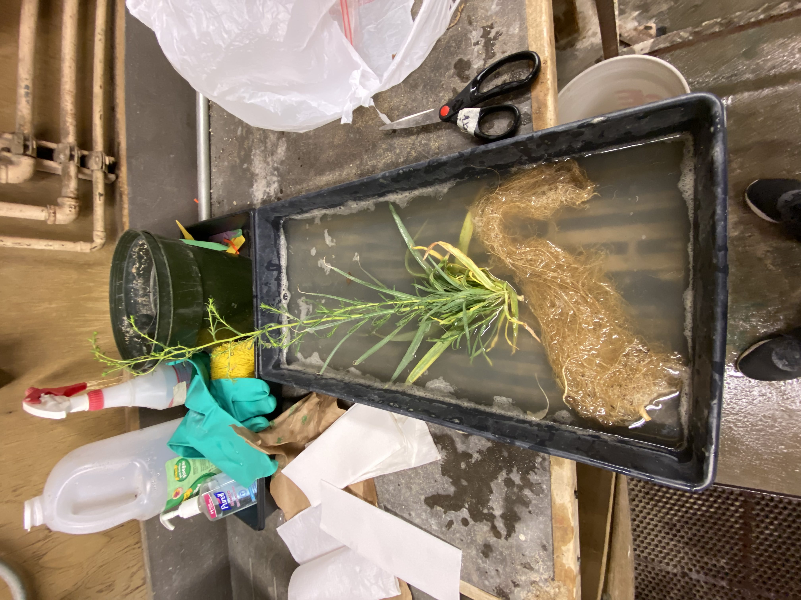
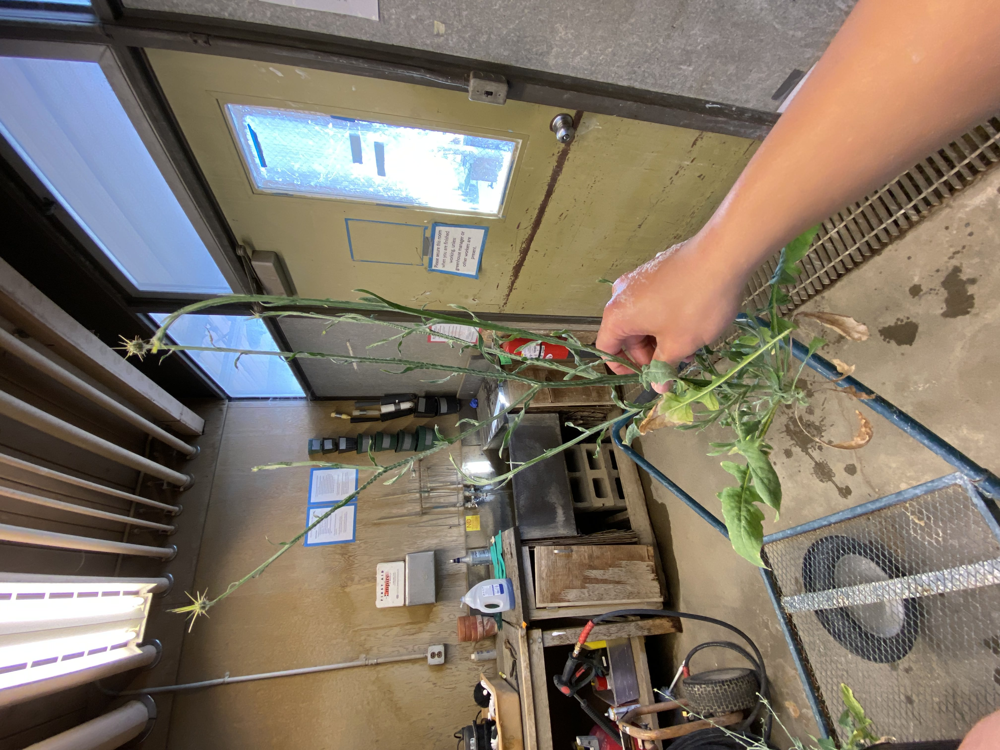
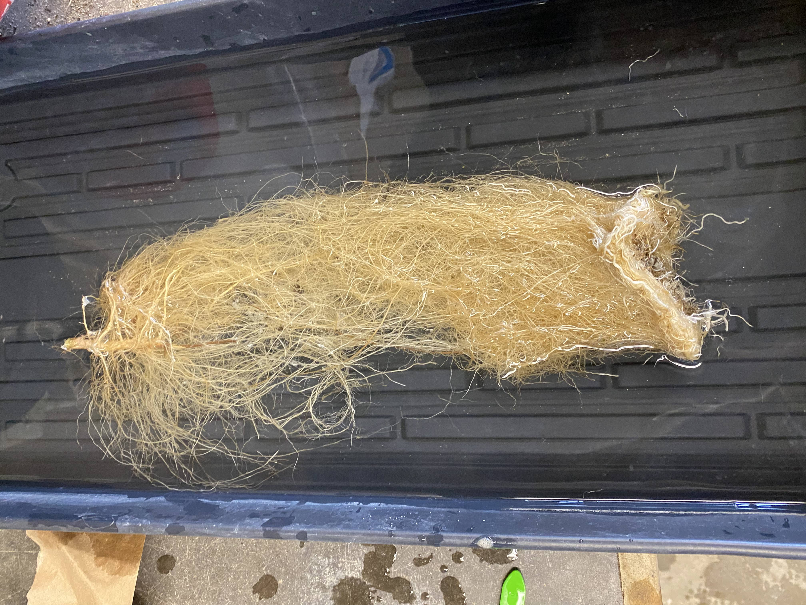

**Introduction**
Introduction and Methods

As Tim's undergraduate senior thesis, he compared the effect of a nitrogen-based fertilizer, which also contains phosphorus and potassium, on the above and below ground traits of California native, Hemizonia congesta (hayfield tarweed, labeled as HECO within the data), and its non-native counterpart, Centaurea solstitialis (yellow starthistle, labeled as CESO within the data). The experiment involves a germination stage followed by 10 weeks of growth within a greenhouse, in which both species are regularly supplied with either a high nutrient or a low nutrient solution. 

For this assignment, we are looking at whether the addition of nutrients or lack thereof, affect plant height, leaf number, leaf area, shoot biomass, and root biomass differently between the invasive C. solstitialis and native H. congesta across 10 weeks of growth. Plant height measurements and leaf number counts are conducted weekly for 10 weeks, while leaf area and biomass measurements are conducted by cohorts of plants. There are 4 cohorts of plants in total, with each cohort harvested after 1 week, 3 weeks, 6 weeks, and 10 weeks of growth respectively (see figure 1). 

Exhibiting higher values in these 5 measured traits could indicate better fitness capabilities in resource acquisition (roots) or photosynthetic productivity (shoots/leaves). The purpose of this study is to shed light on how similar native and invasive species respond to different nutrient availability, informing the early role of nutrients in establishment within California grasslands. 

H. congesta and C. solstitialis are at the forefront of competition within California grasslands, with both species being annuals and from the same family (Asteraceae). For land managers and restoration practitioners in California grasslands, this study could inform timing decisions for applying or immobilizing nutrients, either to limit the spread of C. solstitialis or to promote the growth of natives such as H. congesta.

The data used in this study was collected by Tim during his study, which he will upload onto github, but he also plans on publishing the all the complete data once he published his results as an article. 

Figure 1 - experimental design. It should be noted that inside the greenhouse, the position of plants are randomized by species, treatment, and cohort (when plants are collected), and that the purpose of this figure is to clarify the experimental setup of this study.

set path to "ESP106_FINAL_Chen_Jennings"
```{r, echo = FALSE}
setwd("C:/Users/timmy/OneDrive/Desktop/senior thesis/ESP106_FINAL_Chen_Jennings")
library(knitr)
```




#**germination**
```{r, echo=FALSE}
library(knitr)
setwd("C:/Users/timmy/OneDrive/Desktop/senior thesis/ESP106_FINAL_Chen_Jennings")
germ = read.csv("germ.csv")
germ = germ[,0:6]

colnames(germ) = c("treatment", "species", "day", "total_seeds", "germinated", "% germinated")
speciestreatment = paste(germ$species, germ$treatment)
germ = cbind(germ, speciestreatment)
head(kable(germ))

lmg_s = lm(germ$`% germinated` ~ species, data = germ)
summary(lmg_s)
lmg_t = lm(germ$`% germinated` ~ treatment, data = germ)
summary(lmg_t)
```
In our germination data set, we recorded the % germination over time (day) by dividing the number of germinated seeds by the total number of seeds planted

As seen in the results of both linear regression models, those it seems like ceso germinates faster and at a higher %, the effect of both species and treatment aren't statistically significant

#germination plot  
```{r, echo=FALSE}
library(ggplot2)
ggplot(germ, aes(x= day, y = germ$`% germinated`, group = speciestreatment, colour = speciestreatment)) + theme_bw() +
  geom_line(size = 1.25) + theme_bw() +
  labs(y = "% germination", color = "") + 
  geom_point(border = "black", size = 2) +
  scale_color_manual(values=c("firebrick1","pink","dodgerblue","skyblue")) +
  scale_x_continuous("day", breaks = c(1,2,3,4,5,6,7,8,9,10)) +
  theme(legend.position = c(.2, .8),
        legend.margin = margin(2, 4, 4, 4),
        legend.title = element_blank(),
        panel.border = element_rect(colour = "black", fill=NA),
        legend.background = element_blank(),
        legend.box.background = element_rect(colour = "black"))
  
```
Here we can see a pretty rapid growth in the amount of seeds germinated just within the first few days with all plants experiencing germination rates in the 60-80% range within just six days. Native plant HECO experienced slightly lower germination rates and took longer to germinate than invasive counterpart CESO. Despite this numbers are very similar even on grounds of nitrogen percentage in the soil with both low N and high N for both plants having similar germination rates. Then again however, these observed differences may not be statistically significant.

#**Growth data (height, # of leaves)**  
```{r setup, echo=FALSE}
setwd("C:/Users/timmy/OneDrive/Desktop/senior thesis/ESP106_FINAL_Chen_Jennings")
growth = read.csv("totalseedgrowth.csv")
growth = growth[,0:8]
speciestreatment = paste(growth$species, growth$treatment)
growth = cbind(growth, speciestreatment)

colnames(growth) = c("date", "number", "species", "treatment", "cohort", "week", "height", "leaf number", "speciestreatment")
head(kable(growth))

lmh_s = lm(height ~ species, data = growth)
summary(lmh_s)
lmh_t = lm(height ~ treatment, data = growth)
summary(lmh_t)

lml_s = lm(growth$`leaf number` ~ species, data = growth)
summary(lml_s)
lml_t = lm(growth$`leaf number` ~ treatment, data = growth)
summary(lml_t)

#error bars
library(plyr)
data_summary <- function(data, varname, groupnames){
  require(plyr)
  summary_func <- function(x, col){
    c(mean = mean(x[[col]], na.rm=TRUE),
      sd = sd(x[[col]], na.rm=TRUE))
  }
  data_sum<-ddply(data, groupnames, .fun=summary_func,
                  varname)
  data_sum <- rename(data_sum, c("mean" = varname))
 return(data_sum)
}

growthsum = data_summary(growth, varname = "height", groupnames = c("week", "speciestreatment"))
```
For our height and leaf number data set, we recorded plant height and leaf number weekly for 10 weeks, across both species and both treatments.

According to our linear regression models, for plant height there isn't a big difference between species but treatment does affect it significantly. For leaf number on the other hand, there is a significant effect of both species and treatment, which could mean that the difference we see in leaf number could point to both differences in species or differences in treatment. Further analysis will be required.

#height and leaf number graphs  
```{r, echo=FALSE}
library(ggplot2)

height = ggplot(growthsum, aes(x = week, y = height, group = speciestreatment, colour = speciestreatment)) +
  geom_line(size = 1.25) + theme_bw() +
  labs(y = "Average Height (cm)", color = "") + 
  geom_point(size = 2) +
  scale_color_manual(values=c("firebrick1","pink","dodgerblue","skyblue")) +
  scale_x_continuous("week", breaks = c(1,2,3,4,5,6,7,8,9,10)) +
  theme(legend.position = c(.2, .8),
        legend.margin = margin(2, 4, 4, 4),
        legend.title = element_blank(),
        panel.border = element_rect(colour = "black", fill=NA),
        legend.background = element_blank(),
        legend.box.background = element_rect(colour = "black"))


leaf = ggplot(growth, aes(x = week, y = `leaf number`, group = speciestreatment, color = speciestreatment)) +
  geom_line(stat="summary", fun = mean, size = 1.25) + theme_bw() +
  geom_point(stat = "summary", fun = mean, size = 2) +
  labs(y = "Average leaf number", color = "") +
  scale_x_continuous("week", breaks = c(1,2,3,4,5,6,7,8,9,10)) +
  scale_color_manual(values=c("firebrick1","pink","dodgerblue","skyblue")) +
  theme(legend.position = c(.2, .8),
        legend.margin = margin(2, 4, 4, 4),
        legend.title = element_blank(),
        panel.border = element_rect(colour = "black", fill=NA),
        legend.background = element_blank(),
        legend.box.background = element_rect(colour = "black"))

library(gridExtra)
grid.arrange(height, leaf, top = "Plant height and leaf number", ncol = 2)
```
#data with best fit lines  
```{r, echo = FALSE}
ggplot(growth, aes(x = week, y = height, group = speciestreatment, colour = speciestreatment)) +
  geom_point() + theme_bw() +
  scale_x_continuous("week", breaks = c(1,2,3,4,5,6,7,8,9,10)) +
  scale_color_manual(values=c("firebrick1","pink","dodgerblue","skyblue")) +
  geom_smooth(method = lm, se = TRUE) +
  labs(y = "height (cm)", colour = "")
```
The first plot shown here depicts plant height in cm and shows a clear distinction between nitrogen levels in the soil and its effect on vertical growth. Both native and invasive counterparts experienced more vertical growth under high nitrogen conditions than in low nitrogen conditions, with plants grown under high nitrogen conditions growing to around 35 cm and low nitrogen plants growing to around 15 cm. 

In terms of leaf number, there was a clear distinction between native plant Heco in high nitrogen conditions and everything else, with high N Heco leaf numbers being around 150 leaves per plant and every other category being lower at around 20-40 leaves per plant. 

The third plot shown here depicts the height plot under a best fit linear regression and depicts how plants under high nitrogen conditions experience more outliers from the established growth rate at around week 8 of growth with many plants experiencing rapid growth and entering its reproductive stages at this time.
  
#**Biomass and leaf area data**  
```{r, echo = FALSE}
setwd("C:/Users/timmy/OneDrive/Desktop/senior thesis/ESP106_FINAL_Chen_Jennings")
massleaf = read.csv("biomassLA.csv")

speciestreatment = paste(massleaf$species, massleaf$treatment)
ml = cbind(massleaf, speciestreatment)
ml$cohort = as.character(ml$cohort)

colnames(ml) = c("number", " species", "treatment", "cohort", "date_harvested", "leaf_area", "fresh.shoot.biomass", "dry.shoot.biomass", "fresh.root.biomass", "dry.root.biomass", "speciestreatment")
head(kable(ml))

c1 = subset(ml, cohort == 1)
c2 = subset(ml, cohort == 2)
c3 = subset(ml, cohort == 3)
c4 = subset(ml, cohort == 4)

c1.ds.sum = data_summary(c1, varname = "dry.shoot.biomass", groupnames = c("cohort", "speciestreatment"))
c2.ds.sum = data_summary(c2, varname = "dry.shoot.biomass", groupnames = c("cohort", "speciestreatment"))
c3.ds.sum = data_summary(c3, varname = "dry.shoot.biomass", groupnames = c("cohort", "speciestreatment"))
c4.ds.sum = data_summary(c4, varname = "dry.shoot.biomass", groupnames = c("cohort", "speciestreatment"))
```
separated by shoot biomass(above ground) and root biomass(below ground). The plants were harvested in cohorts, with each cohort set to be harvested at a predetermined time (week1, 3, 6, and 10 respectively for our 4 cohorts). We measured both the fresh biomass, which was measured right after the harvest, and dry biomass, which was measured after 48 hours in the oven. In our analysis and graphs we decided to look at dry biomass for both, since it eliminates potential variabilities that come with water weight. In addition to biomass, we also measured the surface area of a random leaf for each plant.

We used ANOVA to analyze our data, and we found that both species and treatment had a significant effect in dry shoot biomass, dry root biomass, and leaf area. For more clarification, we also used Tukey HSD tests to analyze which treatment/species pairs saw the biggest difference in shoot dry biomass, root dry biomass, and leaf area, which can allow us to determine the best treatment to benefit the native heco and limit the invasive ceso. 

#data analysis summaries
```{r, echo=FALSE}
dsaov = aov(dry.shoot.biomass ~ speciestreatment + cohort, data = ml)
draov = aov(dry.root.biomass ~ speciestreatment + cohort, data = ml)
laaov = aov(leaf_area ~ speciestreatment + cohort, data = ml)

summary(dsaov)
summary(draov)
summary(laaov)

TukeyHSD(dsaov)
TukeyHSD(draov)
TukeyHSD(laaov)
```

#shoot dry biomass  
```{r, echo=FALSE}
library(ggplot2)

ds1 <- ggplot(c1.ds.sum, aes(x = speciestreatment, y = dry.shoot.biomass, fill = speciestreatment)) + 
  geom_bar(position = "dodge", stat = "identity", width = 0.5) +
  geom_errorbar(aes(ymin=dry.shoot.biomass-sd, ymax=dry.shoot.biomass+sd), width = 0.3, alpha=0.9, size=1.05) +
  scale_fill_manual(values=c("firebrick1","pink","dodgerblue","skyblue")) +
  labs(x = "cohort 1 / week 1", y = "shoot fresh biomass (g)") +
  theme_bw() + theme(legend.position = "none")

ds2 <- ggplot(c2.ds.sum, aes(x = speciestreatment, y = dry.shoot.biomass, fill = speciestreatment)) + 
  geom_bar(position = "dodge", stat = "identity", width = 0.5) +
  scale_fill_manual(values=c("firebrick1","pink","dodgerblue","skyblue")) +
  geom_errorbar(aes(ymin=dry.shoot.biomass-sd, ymax=dry.shoot.biomass+sd), width = 0.3, alpha=0.9, size=1.05) +
  labs(x = "cohort 2 / week 3", y = "shoot fresh biomass (g)") +
  theme_bw() + theme(legend.position = "none", axis.title.y = element_blank())

ds3 <- ggplot(c3.ds.sum, aes(x = speciestreatment, y = dry.shoot.biomass, fill = speciestreatment)) + 
  geom_bar(position = "dodge", stat = "identity", width = 0.5) +
  scale_fill_manual(values=c("firebrick1","pink","dodgerblue","skyblue")) +
  geom_errorbar(aes(ymin=dry.shoot.biomass-sd, ymax=dry.shoot.biomass+sd), width = 0.3, alpha=0.9, size=1.05) +
  labs(x = "cohort 3 / week 6", y = "shoot fresh biomass (g)") +
  theme_bw() + theme(legend.position = "none", axis.title.y = element_blank())

ds4 = ggplot(c4.ds.sum, aes(x = speciestreatment, y = dry.shoot.biomass, fill = speciestreatment)) + 
  geom_bar(position = "dodge", stat = "identity", width = 0.5) +
  scale_fill_manual(values=c("firebrick1","pink","dodgerblue","skyblue")) +
  geom_errorbar(aes(ymin=dry.shoot.biomass-sd, ymax=dry.shoot.biomass+sd), width = 0.3, alpha=0.9, size = 1.05) +
  labs(x = "cohort 4 / week 10", y = "shoot fresh biomass (g)") +
  theme_bw() + theme(legend.position = "none", axis.title.y = element_blank())
require(gridExtra)
grid.arrange(ds1, ds2, ds3, ds4, top = "Dry Shoot Biomass (g)", ncol = 2)
```
This graph depicts biomass of the shoots of every plant in each cohort. There is a pretty uniform distribution in the first week as every plant begins germination and growth but by week 6 (cohort/ graph 3) invasive plant ceso under high nitrogen conditions gains much biomass outpacing other variations. By week 10 native plant heco catches up until both high N plants are around 4-5 g in mass. These charts also depict the level of variance between each subgroup and it can be shown that typically invasive plant ceso under high nitrogen conditions has more variance than other subgroups. Overall the invasive plant under high nitrogen conditions grew faster than other subgroups with both plants under low N conditions experienced very little growth.

#Root dry biomass
```{r, echo=FALSE}
c1m_rd = data_summary(c1, varname = "dry.root.biomass", groupnames = c("cohort", "speciestreatment"))
c2m_rd = data_summary(c2, varname = "dry.root.biomass", groupnames = c("cohort", "speciestreatment"))
c3m_rd = data_summary(c3, varname = "dry.root.biomass", groupnames = c("cohort", "speciestreatment"))
c4m_rd = data_summary(c4, varname = "dry.root.biomass", groupnames = c("cohort", "speciestreatment"))

rd1 <- ggplot(c1m_rd, aes(x = speciestreatment, y = dry.root.biomass, fill = speciestreatment)) + labs(x = "week 1 / cohort 1", y = "") +
  geom_bar(position = "dodge", stat = "identity", width = 0.5) +
  geom_errorbar(aes(ymin=dry.root.biomass-sd, ymax=dry.root.biomass+sd), width = 0.3, alpha=0.9, size=1.05) +
  scale_fill_manual(values=c("firebrick1","pink","dodgerblue","skyblue")) +
  theme_bw() + theme(legend.position = "none")

rd2 <- ggplot(c2m_rd, aes(x = speciestreatment, y = dry.root.biomass, fill = speciestreatment)) + geom_bar(position = "dodge", stat = "identity", width = 0.5) +
  geom_errorbar(aes(ymin=dry.root.biomass-sd, ymax=dry.root.biomass+sd), width = 0.3, alpha=0.9, size=1.05) +
  labs(x = "week 3 / cohort 2", y = "root dry biomass (g)") +
  scale_fill_manual(values=c("firebrick1","pink","dodgerblue","skyblue")) +
  theme_bw() + theme(legend.position = "none", axis.title.y = element_blank())

rd3 <- ggplot(c3m_rd, aes(x = speciestreatment, y = dry.root.biomass, fill = speciestreatment)) + geom_bar(position = "dodge", stat = "identity", width = 0.5) +
  geom_errorbar(aes(ymin=dry.root.biomass-sd, ymax=dry.root.biomass+sd), width = 0.3, alpha=0.9, size=1.05) +
  labs(x = "week 6 / cohort 3", y = "shoot dry biomass (g)") +
  scale_fill_manual(values=c("firebrick1","pink","dodgerblue","skyblue")) +
  theme_bw() + theme(legend.position = "none", axis.title.y = element_blank())

rd4 <- ggplot(c4m_rd, aes(x = speciestreatment, y = dry.root.biomass, fill = speciestreatment)) + geom_bar(position = "dodge", stat = "identity", width = 0.5) +
  geom_errorbar(aes(ymin=dry.root.biomass-sd, ymax=dry.root.biomass+sd), width = 0.3, alpha=0.9, size=1.05) +
  labs(x = "week 10 / cohort 4", y = "shoot dry biomass (g)") + 
  scale_fill_manual(values=c("firebrick1","pink","dodgerblue","skyblue")) +
  theme_bw() + theme(legend.position = "none", axis.title.y = element_blank())
require(gridExtra)
grid.arrange(rd1, rd2, rd3, rd4, top = "Root Dry Biomass (g)", ncol = 2)
```
  Here the same statistic of biomass is portrayed except this time in the root system instead of the above ground shoots of the four subgroups. There is a similar trend here with pretty uniform distribution of growth across the first two cohorts (from week 1 to week 3) until invasive ceso under high N conditions grows quicker than the other subgroups in week 6 until eventually native heco grows to about the same level in week 10 to around 5 grams. Across all cohorts invasive plant ceso under high nitrogen conditions had the most variance in week 6.


#RS ratio  
```{r, echo=FALSE}
rsratio = ml$dry.root.biomass/ml$dry.shoot.biomass
ml = cbind(ml, rsratio)

rs_sum = data_summary(ml, varname = "rsratio", groupnames = c("cohort", "speciestreatment"))

ggplot(rs_sum, aes(x = cohort, y = rsratio, fill = speciestreatment)) + 
  geom_bar(position = "dodge", stat = "identity") + theme_bw() + 
   geom_errorbar(aes(ymin=rsratio-sd, ymax=rsratio+sd), width = 0.3, alpha=0.9, size=1.05, position=position_dodge(.9)) +
  labs(x = "cohort (c1 = week 1, c2 = week 3, c3 = week 6, c4 = week 10)", y = "root / shoot dry biomass", fill = "") +
  scale_fill_manual(values=c("firebrick1","pink","dodgerblue","skyblue"))
#rs ratio > 1 = more roots than shoot. rs ratio < 1 = less roots than shoot
```
  
This graph depicts the ratio of dried root biomass to dried shoot biomass. As can be seen the first two cohorts have too small of a ratio to show any significant difference in growth rates but beginning in cohort 3 it can be seen that the roots of both plants grow significantly faster under low nitrogen conditions, while experiencing much lower biomass overall. This could perhaps show how lower nitrogen conditions lead to plants putting more resources into root growth to gain access to more nutrients in the soil. There is also a pretty high variance among all subgroups starting in cohort 3.

#leaf area  
```{r, echo=FALSE}
ggplot(ml, aes(x = cohort, y = leaf_area, group = speciestreatment, fill = speciestreatment)) +
  geom_bar(position = "dodge", stat = "summary", fun = mean, width = 0.5) +
  scale_fill_manual(values=c("firebrick1","pink","dodgerblue","skyblue")) +
  theme_bw() + labs(x = "cohort", y = "leaf area (cm2)", fill = "")

ggplot(ml, aes(x = cohort, y = leaf_area, fill = speciestreatment)) +
  geom_boxplot(width = 0.7) +
  scale_fill_manual(values=c("firebrick1","pink","dodgerblue","skyblue")) +
  theme_bw() + labs(x = "cohort", y = "leaf area (cm2)", fill = "")
```
In this box plot depicting leaf area in centimeters squared, there is an obvious distinction between invasive plant ceso under high N conditions and other subgroups in leaf area with this subgroup being around 35 cm^2. There is also a distinction in that this group also has the most variance among all other subgroups. 

#**conclusions**
This project shows the importance of soil nutrient level in planning the promotion or restriction of certain plants. If limiting the amount of invasive species is to be achieved there should be an understanding in the role of nutrients as well as other resources in growth. As the plots depicting biomass showed, the invasive Centaurea solstitialis grew much quicker than native counterpart under high nitrogen conditions in cohort 3 before the native plant could catch up. 

For land managers and restoration practitioners, this potentially implies that keeping soils with low nutrient concentrations, most importantly after week 6, can allow invasive species to be less competitive and less likely to outperform natives and spread. In addition, our results implicate that certain situations such as nutrient runoff via irresponsible agricultural activity or factory waste, or if atmospheric nitrogen deposition rates are high, invasive species may grow much quicker than native counterparts, leaving very little space for the native species to grow. It can also be seen that the invasive Centaurea solstitialis has a higher leaf area while native Hemizonia congesta has a higher amount of leaves, factors like this must be taken into account when observing ecological systems. 


#Future directions
- creating and adding spatial data (how sunlight and temperature differ depending on plant positions inside the greenhouse)

